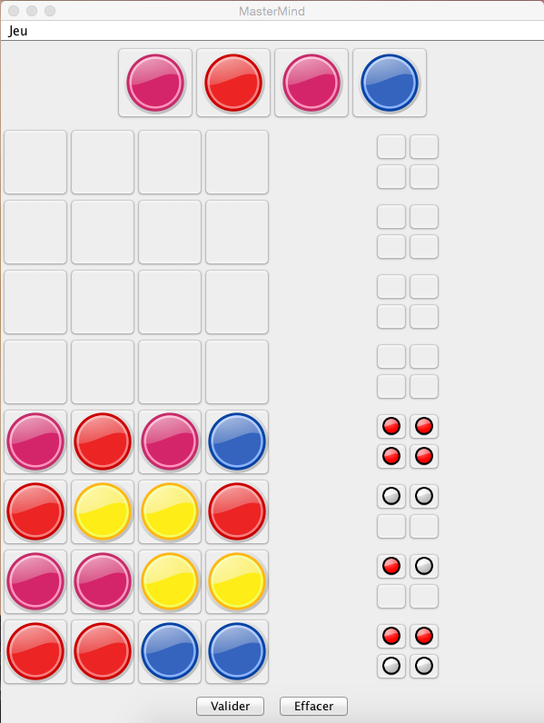

#Test d'IHM et langage Java

**Test du samedi 6 juin 2015 – Durée 2 heures – Documents autorisés**

L'objet de ce test est l'écriture en Java de l'IHM d'une version simplifiée du jeu Mastermind. Le Mastermind est un jeu de société pour deux joueurs dont le but est de trouver une combinaison de couleurs.

Il se présente sous la forme d'un plateau perforé de 10 rangées de quatre trous pouvant accueillir des pions de couleurs.

Le nombre de pions de couleurs différentes est de 8 et les huit couleurs sont généralement : rouge ; jaune ; vert ; bleu ; orange ; marron ; violet ; fuchsia.

Il y a également des pions de score blancs et rouges (ou noirs) utilisés pour donner des indications à chaque étape du jeu.

## Règles du jeu

Dans ce jeu, les joueur endossent à tour de role un comportement actif ou passif. Un des deux joueur commence par placer son choix de pions sans qu'ils soient vus de l'autre joueur à l'arrière d'un cache qui les masquera à la vue de celui-ci jusqu'à la fin de la manche. Ce joeur sera appelé joueur passif car une fois la combinaison choisie, il est surtout dans un rôle d'attente.

Le joueur qui n'a pas sélectionné les pions doit trouver quels sont les quatre pions, c'est-à-dire leurs couleurs et positions. Ce joueur est désigné comme joueur actif.

Pour cela, à chaque tour, le joueur actif doit se servir de pions pour remplir une rangée selon l'idée qu'il se fait des pions dissimulés.

Une fois les pions placés, le joueur passif indique :

1. le nombre de pions de la bonne couleur bien placés en utilisant le même nombre de pions de score rouges ;
2. le nombre de pions de la bonne couleur, mais mal placés, avec les pions de score blancs.

Il arrive donc surtout en début de partie qu'il ne fasse rien concrètement et qu'il n'ait à dire qu'aucun pion ne correspond, en couleur ou en couleur et position.

La tactique du joueur actif consiste à sélectionner en fonction des coups précédents, couleurs et positions, de manière à obtenir le maximum d'informations de la réponse du partenaire puisque le nombre de propositions est limité par le nombre de rangées de trous du jeu. Dans la plupart des cas, il s'efforce de se rapprocher le plus possible de la solution, compte tenu des réponses précédentes, mais il peut aussi former une combinaison dans le seul but de vérifier une partie des conclusions des coups précédents et de faire en conséquence la proposition la plus propice à la déduction d'une nouvelle information.

Le joueur actif gagne cette manche s'il donne la bonne combinaison de pions sur la dernière rangée ou avant.

## Travail à réaliser
Votre travail dans la suite de ce sujet sera d'écrire pas à pas plusieurs classes importantes :
- Un objet `MastermindIHM` est une fenêtre de jeu avec laquelle les joueurs interagiront pour faire une partie.
- Un objet `Plateau` représente le plateau de jeu composé des 10 rangées de 4 case.
- Un objet `Pion` représente le pion que le joueur actif déposera dans une case.
- Un objet `CasePion` représente une case du plateau de jeu où le joueur actif pourra déposer un pion.
- Un objet `Combinaison` permet de manipuler une combinaison de couleur.
- Un objet `Rangée` permet de regrouper les cases dans lesquels le joueur actif propose ses combinaisons de couleurs.
- Un objet `Score` représente le pion de score que le joueur passif déposera dans une case.
- Un objet `CaseScore` représente une case du plateau de jeu où le joueur passif pourra déposer un pion de score.
- Un objet `MarquageScore` permet de regrouper les cases dans lesquels le joueur passif donne les indications sur la  combinaison proposée par le joueur actif.

Il y aura aussi plusieurs classes de moindre importance qui serviront d'outils pour les classes principales.

L'objectif de ce test est d'évaluer votre capacité à écrire une IHM à l'aide du langage Java, les méthodes complexes 
car trop algorithmiques n'auront pas à être implémentées. Vous pourrez retrouver une proposition de correction à l'adresse suivante : https://github.com/IUTInfoAix/TestIHM2015/

Le résultat attendu devra ressembler à la fenêtre suivante :

### Implémentation de la classe `Pion`
La classe `Pion` permet de représenter les pions de couleurs utilisés par le joueur actif. La responsabilité principale de cette classe est de conserver l'ensemble des pions ainsi que leur apparence.

1. Écrire la classe `Pion` ayant pour commencer, une seule donnée membre privée. Elle se nommera `icon` de type `Icon` permettra de conserver l'image affichée dans les cases.
2. Écrire le constructeur `Pion(String fileName)` qui crée l'`ImageIcon` à partir du nom de fichier passé en paramètre.
3. Écrire l'accésseur `public Icon getIcon()` qui retourne la donnée membre `icon`.
3. Les couleurs de pion étant connus à l'avance (`ROUGE`, `BLEU`, `FUCHSIA`, `JAUNE`, `MARRON`, `ORANGE`, `VERT` et `VIOLET`), leur création peut être faite de manière statique. Pour éviter d'avoir à complexifier notre code avec des valeurs nulles, un pion virtuel (`VIDE`) sera ajouté. Écrire la déclaration statiques des 3 première couleurs de pions  (`ROUGE`, `BLEU`, `FUCHSIA`) qui devront utiliser les images appelées "rouge.png", "bleu.png", "fuchsia.png". Pour la suite on considèrera que toutes les données membres ont été correctement initialisées.
4. Écrire la méthode `public Pion suivant()` qui retourne le pion `BLEU` si le pion est `ROUGE` et `FUCHSIA` si le pion est `BLEU` et ainsi de suite. Pour vous faciliter l'écriture de cette méthode, il peut être astucieux de stocker vos pions précédement crée dans un tableau.

### Implémentation de la classe `CasePion`
Pour réaliser le plateau de jeu, il nous faut des boutons sur lesquels on pourra déposer des pions. 

Écrire la classe publique `CasePion` qui représente les boutons de notre plateau de jeu. Cette classe aura les caractéristiques suivantes :
- Elle étend la classe `JButton`.
- Elle dispose une donnée membre privée nommée `pion` mémorisant le pion déposé sur la case. 
- Elle possède un accèsseur et un modifieur publics pour cette donnée membre. Le modifieur à la responsabilité de changer l'icone de la case (avec la méthode `setIcon(ImageIcon icon)` héritée de la classe `JButton`).
- Elle possède une méthode `void vider()` qui s'occupe d'enlever le pion de la case (penser à `Pion.VIDE`).
- Elle possède une méthode `void setMasqué(boolean masqué)` qui s'occupe de masquer/démasquer le pion contenu dans la case. Cette méthode sera utilisée par le joueur passif pour masquer sa combinaison et la montrer en fin de partie.
- Elle dispose d'une donnée membre `boutonPionListener` du type `ActionListener`. Son initialisation sera faite en même temps que sa déclaration avec une classe anonyme qui surchagera la méthode `void actionPerformed(ActionEvent actionEvent)`. Cette surcharge fera en sorte qu'à chaque action sur une case, le pion déposé dessus passe au `suivant`.
- Elle a un unique constructeur sans argument, qui vide la case, lui affecte un auditeur d'événements (l'`ActionListener` précédement créé), par défaut la case est inactive (avec `setEnabled(Boolean b)`).

### Implémentation de la classe `Combinaison`
Pour pouvoir implémenter la logique du jeu, il faut disposer d'une abstraction permettant de comparer deux combinaisons de pion de couleur. 

1. Écrire la classe publique `Combinaison` ayant deux données membres privée. La première appelée `taille` sera de type `int` et permettra de connaitre le nombre de pions qui constitue la combinaison. La seconde appelée `pions` sera un tableau de `Pion` qui conservera les couleurs constitutives de la combinaison.
2. Écrire le constructeur `Combinaison(int taille)` qui initialise correctement les deux données membres. Par défaut, la combinaison sera vide (penser `Pion.VIDE`).
3. Écrire l'accesseur et le modifieur associés à la donnée membre privée `pions`.
4. Écrire l'accesseur de la donnée membre `taille`.
4. Écrire la méthode publique `boolean contient(Pion pion)` qui permet de savoir si un Pion appartient à une combinaison.

Pour la suite, on supose que l'on disposera de la méthode de classe `static Combinaison genererCombinaisonAléatoire(int taille)` qui permet comme son nom l'indique de générer une combinaison aléatoire.

### Implémentation de la classe `Rangée`
La classe `Rangée` à pour responsabilité de regrouper l'ensemble des cases dans lesquels le joueur peut déposer une combinaison de couleur. 

Écrire la classe publique `Rangée` qui représente une rangée de case de notre plateau de jeu. Cette classe aura les caractéristiques suivantes :
- Elle étend la classe `JPanel`.
- Elle dispose une donnée membre privée nommée `pions` de type `CasePion[]` qui conserve toutes les cases constitutives de la rangée.
- Elle dispose d'une donnée membre privée nommée `taille` qui permet de connaitre le nombre de case dans la rangée.
- Elle possède une méthode `void vider()` qui s'occupe d'enlever les pion (vider) des différentes cases.
- Elle possède une méthode `void setMasqué(boolean enabled)` qui s'occupe de masquer/démasquer les pion des différentes cases.
- Elle possède une méthode `void setEnabled(boolean enabled)` qui s'occupe d'activer/désactiver les pion des différentes cases.
- Elle possède une méthode `void setCombinaison(Combinaison combinaison)` qui s'occupe de modifier les pion des différentes cases en fonction de la combinaison passée en argument.

- Elle possède une méthode `Combinaison getCombinaison()` qui crée et retourne une combinaison de même taille que la rangée et qui parcours les `CasePion` pour y lire les pions contenus.

- Elle a un unique constructeur,`Rangée(int taille)` ,avec un argument argument. Ce constructeur doit initialiser les deux données membres. Ajouter un `GridLayout` avec une seule ligne et un nombre inconnu de colonne comme gestionnaire de disposition. Parcourir l'ensemble des cases et les rajouter à la rangée.

### Implémentation des classes `Score`, `CaseScore` et `MarquageScore`
Les classes `Score`, `CaseScore` et `MarquageScore` sont très similaires aux classes que l'on vient d'implémenter. Pour la suite du travail, vous aurez juste besoin d'utiliser la méthode `public void setScore(int nombrePionsBiensPlacés, int nombrePionsMalsPlacés)` et ` public void vider()` de la classe `MarquageScore`. Vous considérez donc en disposer.

### Implémentation de la classe `Plateau`
Cette classe est celle qui permet d'implémenter toute la logique du jeu. Elle est celle qui 
demanderait le plus de travail dans une implémentation complète. Dans votre cas, vous n'aurez pas à implémenter 
les méthodes qui calculeront le nombre de pions biens ou mals placés. Vous suposerez donc que vous disposer de deux méthodes qui remplissent cet office(`int calculerNombrePionsMalsPlacés(Combinaison combinaisonSecrète)` et `int calculerNombrePionsBiensPlacés(Combinaison combinaisonSecrète)`).

1. Écrire la classe `Plateau` qui dérive de `JPanel`. Cette classe aura les données membres privées suivantes : 
     - `nombrePionsParRangée` de type `int` qui mémorise la taille d'une rangée du plateau de jeu.
     - `nombreRangées` de type `int` qui mémorise le nombre de rangées du plateau de jeu.
     - `rangées` est un tableau `nombreRangées` `Rangée` qui représente le plateau de jeu.
     - `scores` est un tableau `nombreRangées` `MarquageScore` qui représente la colone de marquage de pions biens/mals placés.
     - `rangéeCourante` de type `int` qui mémorise l'indice de la rangée actuellement jouée.
     - `aGagné` de type `boolean` qui mémorise si le dernier coup était gagnant.
2. Écrire le constructeur `Plateau(int nombreRangées, int nombrePionsParRangée)` qui initialise toute les données membres. Qui définit un gestionnaire de placement de type grille avec deux colonnes et un nombre indéterminé de lignes. Chaque rangée et chaque score devra être ajouté dans le bon ordre au plateau de jeu. Seule la première ligne devra être activée en début de partie(`setEnabled(true)`).
2. Écrire la méthode `private void vider()` qui parcourt toutes les rangées et tous les scores un par un pour les vider.
3. Écrire la méthode `private void viderRangéeCourante()` qui vide uniquement la rangée courante.
4. Ecrire la méthode `public int nombreDeCoupsJoués()` qui retourne le nombre de coups joués depuis le début de la partie.
5. Écrire la méthode `public boolean aGagné()` qui retourne le booléen indiquant si le dernier coup est gagnant.
6. Écrire la méthode `public boolean aPerdu()` qui retourne un booléen indiquant si le dernier coup est perdant.
7. Écrire la méthode `public boolean estFinDePartie()` qui retourne un booléen indiquant si la partie est terminée.
8. Écrire la méthode `public void nouvellePartie()` qui réinitialise le plateau de jeu en vidant les scores, les rangées et en activant uniquement la première rangée.
9. Écrire la méthode `void validerRangéeCourante(Combinaison combinaisonSecrète)` qui a pour responsabilité de valider une combinaison passée en paramêtre, de calculer les scores et de mettre à jour le booléens `aGagné` et la donnée membre `rangéeCourante`. C'est cette méthode qui doit s'occuper de désactiver la rangée qui vient d'être jouée et d'activer la suivante.

### Implémentation de la classe `MastermindIHM`
La classe `MastermindIHM` représente la fenêtre principale du Jeu. En plus du plateau situé au centre, cette fenêtre contient une barre de menu, un panel en haut contenant une rangée de pion matérialisant la combinaison à trouver et un panel en bas contenant deux boutons qui permettent de valider un coup ou d'effacer la dernière combinaison non validée. La barre de menu contient un menu "Action" constitué d'une entrée "Nouvelle Partie" et d'une entrée "Quitter".

1. Écrire la déclaration d’une classe `MastermindIHM`, sous-classe de `JFrame`, réduite, pour commencer, à 
ses variables d’instance, toutes privées :
    - `TAILLE_RANGEE` de type `int` représente la taille d'une rangée
    - `TAILLE_PLATEAU` de type `int` représente la taille du plateau en nombre de rangées.
    - `panelBas` de type `JPanel` est l'objet contenant les boutons de validation et d'effacement.
    - `panelHaut` de type `JPanel` est l'objet contenant la rangée à deviner.
    - `plateau` de type `Plateau` est l'objet plateau de jeu
2. Écrire la méthode  `private JMenuBar barreDeMenus()` qui s'occupe de créer la barre de menu.
3. Écrire le constructeur par défaut de la classe `MastermindIHM`. Ce constructeur devra :
    - Modifier le titre de la fenêtre en "Mastermind".
    - Définir que l'application devra se terminer quand on fermera la fenêtre.
    - Ajouter un `BorderLayout` comme gestionnaire de disposition.
    - Ajouter la barre de menu.
    - Placer le plateau au centre de la fenêtre.
    - Placer le `panelBas` au sud de la fenêtre (la construction de ce panel se fait avec la méthode `creerPanelValidationRangéeCourante()` que vous n'avez pas à implémenter).
    - Placer le `panelHaut` au nord de la fenêtre (la construction de ce panel se fait avec la méthode `creerPanelCombinaisonSecrète()` que vous n'avez pas à implémenter).
    - Demander à la fenêtre de prendre sa taille optimale et la rendre visible.
5. Écrivez une méthode `main` aussi réduite que possible pour lancer l’exécution de tout cela. 
